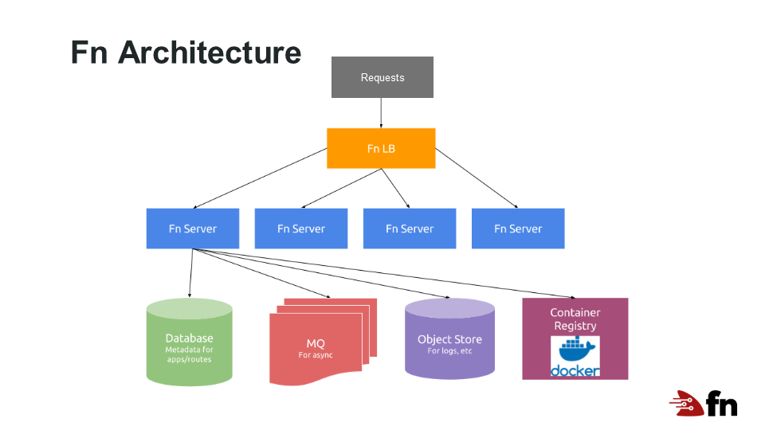

# Introduction to the Fn Project
The Fn project is an open source serverless compute platform. With Fn, you deploy your functions to an Fn server which automatically executes and manages them. Each function is executed in a Docker container enabling the platform to provide broad support for development languages including Java, JavaScript (Node), Go, Python, Ruby, and others. The Fn client and server are simple and elegant. You can run the server locally on your laptop, or on a server in your data center or in the cloud. The Fn project has a strong enterprise focus with emphasis on security, scalability, and observability.

## What is Serverless?
Serverless computing is an architecture style which focuses on increasing productivity. Serverless has two categories - Backend-as-a-Service (BaaS) and Functions-as-a-Service (FaaS). A serverless application lets you focus on writing code (FaaS) using event-driven architectures, and various backends as-a-service (BaaS) instead of having to worry about provisioning, patching, scaling, security, high availability, etc. With FaaS, applications are broken up into small pieces of code (nano services) which are dynamically scheduled and run on-demand. The advantage of this approach is code is called and executed only when needed. This differs from a classic server approach where applications are loaded into a server spending most of their time idle, waiting for requests. Thus, in serverless computing you only need to pay for computing resources you actually use, rather than paying for idle resources.

## Why use Serverless?
First is productivity. With serverless you focus on your code and the platform takes care of the rest. This reduces the time "from idea to production" significantly. In addition, serverless systems should be easier to design and implement as complex issues like scaling, high availability, and security are pushed to the serverless platform. Large scale vendors take on the tougher issues and economies of scale results in a costs savings. This allows you to just focus on your code and what it needs to do. And the cost of serverless applications, over the long haul, should be cheaper as you pay for fewer resources, and not for idle time. 

## How does Serverless Functions Compare with Microservices?
In serverless, the small piece of code that does all the work is called a Function. And, a serverless cloud service typically provide functions-as-a-service (FAAS). Thus all the plumbing needed to provision, scale, patch and maintain the environment is provided by the service.

Microservice architectures have been all the rage. Rather than create one large monolithic service, a service is decomposed into smaller services which provide the same set of functions. It simplifies the develop and creation of web services. However, each microservice is still running its' own server which must be scaled and managed. FAAS takes things one step further.

Web services have been broken down into smaller and simpler components with each change in the architecture. FAAS architecture holds a great deal of promise in reducing cost and complexity of applications.

## The Fn Architecture
The Fn serverless platform provides an open source implementation of these ideas. For example, a typical Fn implementation might look like this:

A load balancer provides a front end to several Fn servers. Each server manages and executes function code as needed. Servers can be scaled up or down as needed.

 With Fn, each function is a [Docker](https://www.docker.com) container. Containers are lightweight and can be customized to include just the tools and languages you need to execute your function. Thus, containers are an ideal option for running function code.

 ## Functions with Fn
 Writing a function for Fn is easy. You just create a small chunk of code that does the following:

 * Gets input via STDIN
 * Produces output to STDOUT
 * Logs any errors to STDERR

You code is deployed to an Fn server where it is staged and ready to go when a call is made for that function. For example, to create and deploy an Fn function, create a `myfunc` directory, change into it, and execute these commands:

* `fn init --runtime node`
    * Creates a boilerplate Node.js app in the current directory.
* `fn run`
    * Runs the function locally to test the output.
* `fn deploy --app nodeapp`
    * Deploys your app to the Fn server. The function is now a part of the app "nodeapp" and the function name is picked up from your directory name. In this case "myfunc". Now your function is deployed and ready to be invoked.
* `fn call nodeapp myfunc`
    * Call the function deployed on the Fn server.
* `curl http://localhost:8080/r/nodeapp/myfunc`
    * Make the same call, but this time to an URL and curl.

### What happens during Deploy
When you deploy your function to an application on Fn server, the following happens:

1. A container image is built with your code and the version number is bumped.
2. Your container image is pushed to your container registry (DockerHub by default).
3. A route is created to your function on the server.

That's it. When you call the function via the call command or curl, the container is executed and the results are returned to you.

### Fn FDKs Makes Function Development Easy
The Fn platform has Function Development Kits (FDKs) which are a set of helper libraries that handle the system internals (protocols, parsing input and output, logic for hot function containers, etc.) automatically thereby making function development easier. Fn has FDKs for popular languages - Java, Node.js, Python, Go, and Ruby.

For other languagues where we don't have FDKs, Fn lets you bring your own docker container and run it as a function.
